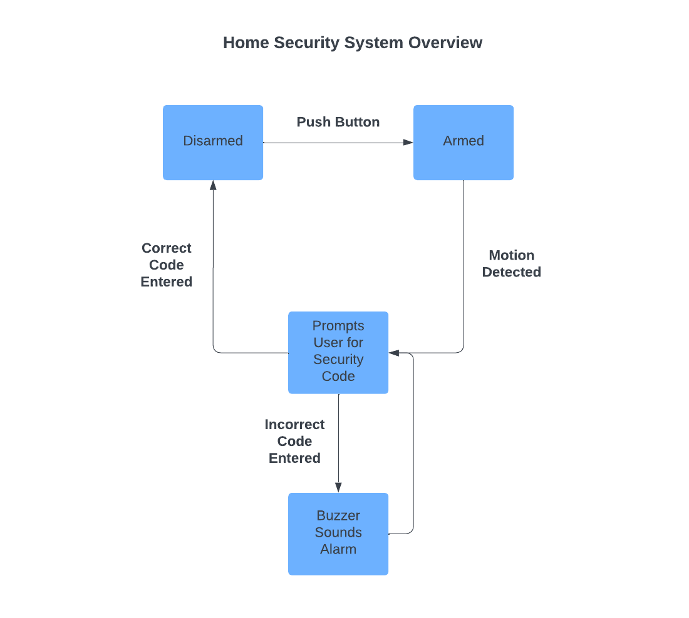

# ECEN 501L Final Project: Home Security System

## Overview of Design

The Home Security System involves four primary states:
- **DISARMED**
- **ARMED**
- **ALARM**
- **SIREN**

The system utilizes tasks to manage these states and ensure reliable transitions. Key features include the use of critical sections, semaphores, thread flags, and a queue to manage resource sharing and time synchronization. The hardware components involved include onboard LEDs, an IMU accelerometer, a hardware timer, a Wi-Fi module, and external interrupt functionality.

### System Initialization
1. **Main Initialization**: 
   - Hardware peripherals, FreeRTOS kernel, and tasks are initialized.
   - System tasks are created and the RTOS scheduler takes control.

2. **Default State (DISARMED)**:
   - LED is off.
   - Wi-Fi server is initialized to allow monitoring or control via a web interface.

### State Transitions
- **DISARMED to ARMED**:
  - Triggered by a button press (GPIO interrupt and semaphore release).
- **ARMED to ALARM**:
  - Triggered when the accelerometer detects motion exceeding a threshold.
- **ALARM to DISARMED/ARMED**:
  - User enters a 4-digit PIN via UART. Correct input transitions the system; incorrect input allows up to 5 attempts.
- **ALARM to SIREN**:
  - After 5 incorrect PIN attempts, the system activates the SIREN state (buzzer/LED).

The system state is viewable and controllable via a web interface. State indications:
- **DISARMED**: LED off.
- **ARMED**: LED on.
- **ALARM**: LED blinking.
- **SIREN**: Buzzer/LED toggled rapidly.

## Implementation Details

### Module Names
- **HAL_GPIO_EXTI_Callback**
- **ToggleState**
- **ActivateBuzzer**
- **Wifi_start**, **Wifi_server**, **WebServerProcess**, **WebServerProcessUpdate**, **SendWebPage**
- **SPI3_IRQHandler**
- **ReadAccelero**, **ModelAccelero**
- **StartDefaultTask**, **StartArmed**, **StartAlarm**

### Technologies Used
- **Embedded Components**:
  - STM32, HAL, GPIO, UART, I2C, SPI, USB OTG, timers.
  - CMSIS-RTOS for multithreading and synchronization.
- **Sensors**:
  - Accelerometer for motion detection.
- **Wi-Fi Communication**:
  - HTML web server for real-time updates using HTTP GET/POST.
- **RTOS Features**:
  - Semaphores, queues, and event-driven programming.

### Special Features
1. **State Machine**: Manages transitions between DISARMED, ARMED, ALARM, and SIREN states.
2. **Web Server**: IoT integration allows remote monitoring and control via HTTP requests.
3. **Motion Detection**:
   - Accelerometer differentiates between stationary and moving states using a threshold.
4. **Security Mechanism**:
   - 4-digit PIN verification for disarming the alarm.

### Outputs
- **System Startup**: Initializes peripherals and enters DISARMED state.
- **Button Press**: Transitions between DISARMED and ARMED states.
- **Motion Detected**: Triggers ALARM state.
- **Correct PIN**: Returns to DISARMED/ARMED state.
- **Five Incorrect PIN Attempts**: Activates SIREN state.

## Conclusion

This IoT-enabled Home Security System is based on an STM32 microcontroller and FreeRTOS. It transitions between states based on motion detection (accelerometer) or user input. A web interface enables remote monitoring and control. The design is suitable for home security, motion-sensitive monitoring, or IoT-based alert systems.

## References
- [FreeRTOS Documentation](https://www.freertos.org/)
- [STM32CubeL4 WiFi Applications](https://github.com/STMicroelectronics/STM32CubeL4/tree/master/Projects/B-L475E-IOT01A/Applications/WiFi)
- [CMSIS-RTOS](https://www.keil.com/pack/doc/CMSIS_Dev/RTOS2/html/index.html)
- [STM32 B-L475E-IOT01A Documentation](https://www.st.com/en/evaluation-tools/b-l475e-iot01a.html#documentation)
